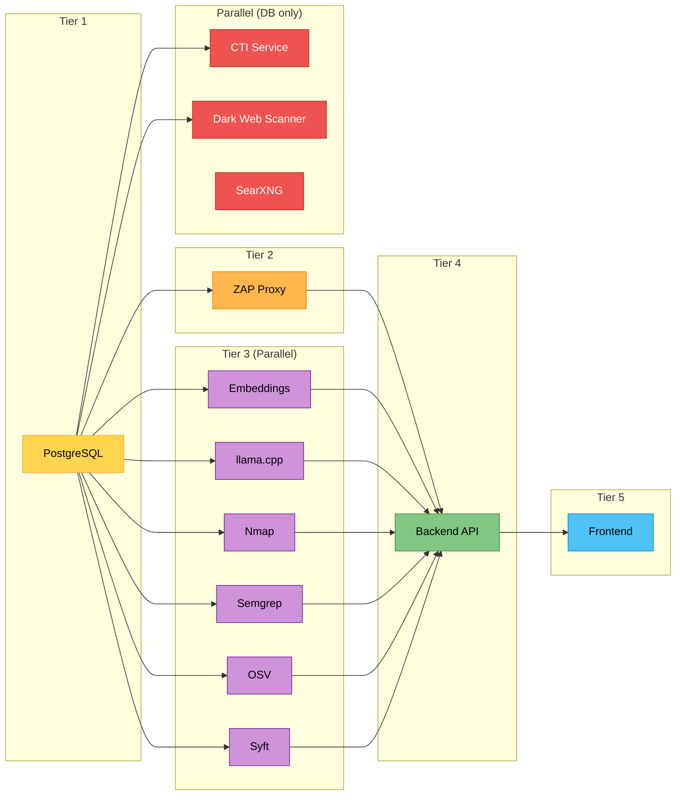
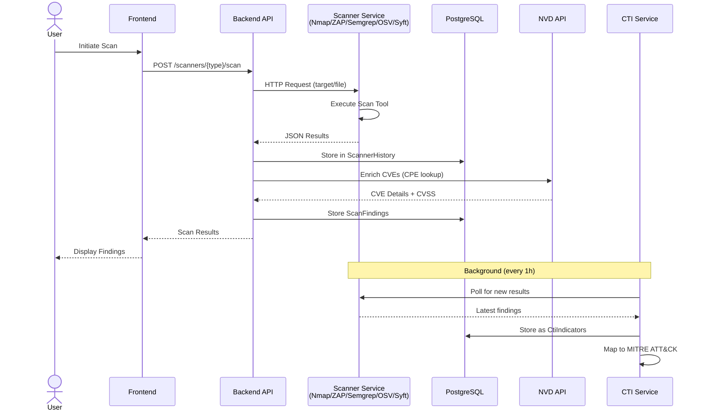
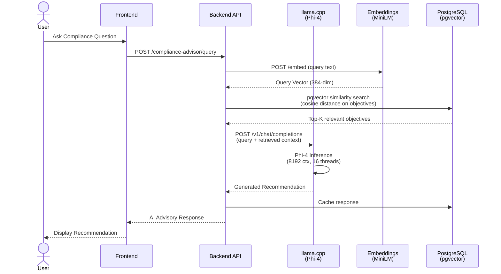
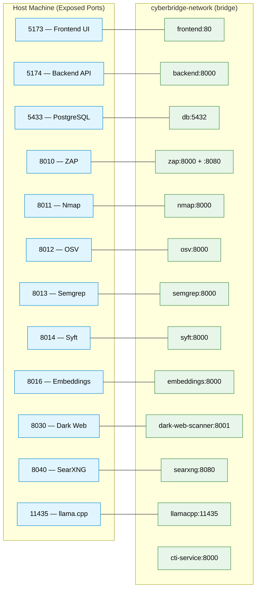
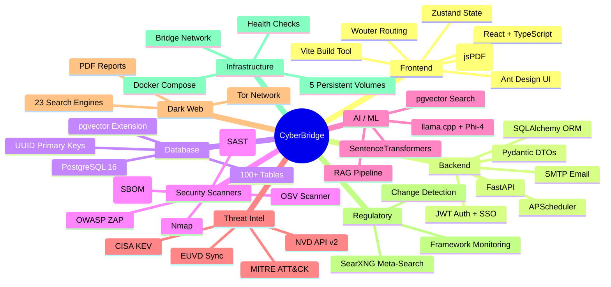

# CyberBridge - End-to-End Architecture Diagram

## High-Level System Architecture

```mermaid
graph TB
    subgraph Users["Users & Clients"]
        Browser["Browser / SPA Client"]
        Auditor["External Auditor<br/>(Magic Link Auth)"]
    end

    subgraph Frontend["Frontend Layer — Port 5173"]
        ReactApp["React + TypeScript + Vite<br/>Ant Design UI<br/>75+ Pages | 56 Zustand Stores<br/>Wouter Routing"]
    end

    subgraph Backend["Backend API Layer — Port 5174 (host) / 8000 (container)"]
        FastAPI["FastAPI Application<br/>59 Route Controllers | 45 Services<br/>46 Repositories | 100+ Models"]

        subgraph BackendModules["Core Modules"]
            AuthModule["Auth & RBAC<br/>JWT / SSO / Magic Links"]
            ComplianceModule["Compliance Engine<br/>Frameworks / Assessments<br/>Gap Analysis / Objectives"]
            RiskModule["Risk Management<br/>Risk Register / Severity<br/>Risk Assessments"]
            ScanOrchestrator["Scan Orchestrator<br/>Scanner Integration<br/>Finding Correlation"]
            AuditModule["Audit & Evidence<br/>Engagements / Findings<br/>Chain of Custody"]
            AIModule["AI Services<br/>LLM Integration<br/>RAG / Embeddings"]
            RegModule["Regulatory Monitor<br/>Framework Updates<br/>Web Search"]
            IncidentModule["Incident Management<br/>ENISA Notifications<br/>Forensic Timeline"]
        end
    end

    subgraph SecurityScanners["Security Scanner Services (Docker Internal Network)"]
        Nmap["Nmap Scanner<br/>Port 8011/8000<br/>Network Recon<br/>Port & Service Detection"]
        ZAP["OWASP ZAP<br/>Port 8010/8000<br/>Web App Security<br/>Spider + Active Scan"]
        Semgrep["Semgrep<br/>Port 8013/8000<br/>SAST Code Analysis<br/>Security Patterns"]
        OSV["OSV Scanner<br/>Port 8012/8000<br/>Dependency Vulns<br/>CVE Matching"]
        Syft["Syft SBOM<br/>Port 8014/8000<br/>CycloneDX SBOM<br/>Component Inventory"]
    end

    subgraph AIServices["AI / ML Services"]
        LlamaCpp["llama.cpp<br/>Port 11435<br/>Phi-4 Model (Q4_K_M)<br/>OpenAI-compatible API"]
        Embeddings["Embeddings Service<br/>Port 8016/8000<br/>all-MiniLM-L6-v2<br/>384-dim Vectors"]
    end

    subgraph ThreatIntel["Threat Intelligence & Monitoring Services"]
        CTI["CTI Service<br/>(Internal Port 8000)<br/>Scanner Aggregation<br/>MITRE ATT&CK Mapping"]
        DarkWeb["Dark Web Scanner<br/>Port 8030/8001<br/>Tor SOCKS Proxy :9050<br/>23 Search Engines"]
        SearXNG["SearXNG<br/>Port 8040/8080<br/>Meta-Search Engine<br/>Regulatory Monitoring"]
    end

    subgraph Database["Data Layer"]
        PostgreSQL[("PostgreSQL 16<br/>+ pgvector Extension<br/>Port 5433 (host) / 5432<br/>UUID Primary Keys")]

        subgraph Volumes["Persistent Volumes"]
            PGData["postgres_data"]
            Uploads["backend_uploads"]
            AuditFiles["audit_attachments"]
            Backups["backend_backups"]
            ZAPData["zap_data"]
        end
    end

    subgraph ExternalAPIs["External APIs & Feeds"]
        NVD["NVD API v2.0<br/>CVE Database"]
        EUVD["EU Vulnerability<br/>Database"]
        MITRE["MITRE ATT&CK<br/>Framework Feed"]
        CISA["CISA KEV<br/>Known Exploited Vulns"]
        FreeTSA["FreeTSA.org<br/>RFC 3161 Timestamps"]
        TorNetwork["Tor Network<br/>Dark Web Access"]
        SearchEngines["Google / Bing /<br/>DuckDuckGo / Scholar"]
    end

    %% User connections
    Browser -->|"HTTPS"| ReactApp
    Auditor -->|"Magic Link"| ReactApp

    %% Frontend to Backend
    ReactApp -->|"REST API + JWT<br/>All /api/* endpoints"| FastAPI

    %% Backend to Scanners
    ScanOrchestrator -->|"HTTP"| Nmap
    ScanOrchestrator -->|"HTTP"| ZAP
    ScanOrchestrator -->|"HTTP"| Semgrep
    ScanOrchestrator -->|"HTTP"| OSV
    ScanOrchestrator -->|"HTTP"| Syft

    %% Backend to AI
    AIModule -->|"OpenAI API<br/>/v1/chat/completions"| LlamaCpp
    AIModule -->|"POST /embed"| Embeddings

    %% Backend to Threat Intel
    FastAPI -->|"HTTP Proxy"| CTI
    FastAPI -->|"HTTP Proxy"| DarkWeb
    RegModule -->|"Search Queries"| SearXNG

    %% Backend to Database
    FastAPI -->|"SQLAlchemy ORM"| PostgreSQL
    CTI -->|"SQLAlchemy"| PostgreSQL
    DarkWeb -->|"Queue Storage"| PostgreSQL

    %% Backend to External APIs
    FastAPI -->|"CVE Lookup"| NVD
    FastAPI -->|"Vuln Sync"| EUVD
    FastAPI -->|"RFC 3161"| FreeTSA

    %% CTI to External Feeds
    CTI -->|"Feed Sync"| MITRE
    CTI -->|"Feed Sync"| CISA

    %% CTI polls scanners
    CTI -.->|"Poll Results<br/>(APScheduler 1h)"| Nmap
    CTI -.->|"Poll Results"| ZAP
    CTI -.->|"Poll Results"| Semgrep
    CTI -.->|"Poll Results"| OSV

    %% Dark Web to Tor
    DarkWeb -->|"SOCKS5 :9050"| TorNetwork

    %% SearXNG to Search Engines
    SearXNG -->|"Meta-Search"| SearchEngines

    %% Embeddings to Database (pgvector)
    Embeddings -.->|"Vector Storage"| PostgreSQL

    %% Volume connections
    PostgreSQL --- PGData
    FastAPI --- Uploads
    FastAPI --- AuditFiles
    FastAPI --- Backups
    ZAP --- ZAPData

    %% Nmap enrichment
    Nmap -->|"CPE → CVE"| NVD

    %% Styling
    classDef frontend fill:#4FC3F7,stroke:#0288D1,color:#000
    classDef backend fill:#81C784,stroke:#388E3C,color:#000
    classDef scanner fill:#FFB74D,stroke:#F57C00,color:#000
    classDef ai fill:#CE93D8,stroke:#7B1FA2,color:#000
    classDef threat fill:#EF5350,stroke:#C62828,color:#fff
    classDef db fill:#FFD54F,stroke:#F9A825,color:#000
    classDef external fill:#B0BEC5,stroke:#546E7A,color:#000
    classDef user fill:#E1F5FE,stroke:#0288D1,color:#000

    class Browser,Auditor user
    class ReactApp frontend
    class FastAPI,AuthModule,ComplianceModule,RiskModule,ScanOrchestrator,AuditModule,AIModule,RegModule,IncidentModule backend
    class Nmap,ZAP,Semgrep,OSV,Syft scanner
    class LlamaCpp,Embeddings ai
    class CTI,DarkWeb,SearXNG threat
    class PostgreSQL,PGData,Uploads,AuditFiles,Backups,ZAPData db
    class NVD,EUVD,MITRE,CISA,FreeTSA,TorNetwork,SearchEngines external
```

## Service Dependency & Startup Order

## Data Flow: Security Scan Pipeline

## Data Flow: AI-Powered Compliance Advisory

## Network & Port Map

## Component Catalog

```mermaid
graph TB
    subgraph core["CORE PLATFORM"]
        FE["<b>FRONTEND — React SPA</b><br/>React + TypeScript + Vite + Ant Design<br/>75+ pages, 56 Zustand stores, Wouter routing<br/>Compliance dashboards, scanning UI, AI advisory<br/><i>Port: 5173</i>"]

        BE["<b>BACKEND API — FastAPI</b><br/>59 route controllers, 45 services, 46 repositories<br/>Orchestrates scanners, auth (JWT/SSO/magic links),<br/>compliance workflows, risk, audit, incident mgmt<br/><i>Port: 5174 → 8000</i>"]

        DB[("<b>DATABASE — PostgreSQL 16 + pgvector</b><br/>100+ tables, UUID primary keys<br/>Users, frameworks, assessments, risks, policies,<br/>scan results, evidence, audit trails<br/>pgvector for RAG semantic search<br/><i>Port: 5433 → 5432</i>")]
    end

    subgraph scanners["SECURITY SCANNERS"]
        NM["<b>NMAP — Network Scanner</b><br/>Port/service detection, OS fingerprinting<br/>CPE-to-CVE enrichment via NVD API<br/><i>Port: 8011 → 8000</i>"]

        ZP["<b>OWASP ZAP — Web App Scanner</b><br/>Spider crawling + active scanning<br/>OWASP Top 10 vulnerability detection<br/><i>Port: 8010 → 8000</i>"]

        SG["<b>SEMGREP — Code Scanner (SAST)</b><br/>Static analysis on uploaded source code<br/>Security patterns, code quality rules<br/><i>Port: 8013 → 8000</i>"]

        OV["<b>OSV SCANNER — Dependency Scanner</b><br/>Scans lock files for known CVEs<br/>NPM, PyPI, Go module support<br/><i>Port: 8012 → 8000</i>"]

        SY["<b>SYFT — SBOM Generator</b><br/>CycloneDX Bill of Materials<br/>Components, versions, licenses inventory<br/><i>Port: 8014 → 8000</i>"]
    end

    subgraph ai["AI / ML SERVICES"]
        LL["<b>LLAMA.CPP — LLM Engine</b><br/>Phi-4 quantized model (Q4_K_M)<br/>OpenAI-compatible API, 8192 ctx window<br/>Risk recommendations, gap analysis, advisory<br/><i>Port: 11435</i>"]

        EM["<b>EMBEDDINGS — SentenceTransformers</b><br/>all-MiniLM-L6-v2 (384-dim vectors)<br/>RAG pipeline: embeds objectives and queries<br/>pgvector semantic similarity search<br/><i>Port: 8016 → 8000</i>"]
    end

    subgraph threat["THREAT INTELLIGENCE & MONITORING"]
        CT["<b>CTI SERVICE — Threat Aggregation</b><br/>Polls all scanners on 1-hour schedule<br/>Syncs MITRE ATT&CK + CISA KEV feeds<br/>Unified threat intelligence dashboards<br/><i>Internal port: 8000</i>"]

        DW["<b>DARK WEB SCANNER — Tor Search</b><br/>SOCKS5 proxy across 23 dark web engines<br/>Detects leaked credentials and data<br/>Queue-based, generates PDF reports<br/><i>Port: 8030 → 8001</i>"]

        SX["<b>SEARXNG — Regulatory Monitor</b><br/>Meta-search: Google, Bing, Scholar, DDG<br/>Detects regulatory changes in CRA, NIS2,<br/>ISO 27001, GDPR, NIST, DORA<br/><i>Port: 8040 → 8080</i>"]
    end

    subgraph external["EXTERNAL FEEDS & APIs"]
        NVD["<b>NVD API v2.0</b><br/>CVE/CVSS vulnerability lookup"]
        EUVD["<b>EU Vulnerability DB</b><br/>EU-specific advisories"]
        MITRE["<b>MITRE ATT&CK</b><br/>Technique/tactic mapping"]
        CISA["<b>CISA KEV</b><br/>Known exploited vulns"]
        TSA["<b>FreeTSA.org</b><br/>RFC 3161 timestamps"]
        TOR["<b>Tor Network</b><br/>Dark web access"]
        SEARCH["<b>Search Engines</b><br/>Google, Bing, DDG, Scholar"]
    end

    subgraph infra["INFRASTRUCTURE"]
        VOL["<b>DOCKER COMPOSE STACK</b><br/>14 containers · cyberbridge-network (bridge)<br/>5 persistent volumes: postgres_data,<br/>backend_uploads, audit_attachments,<br/>backend_backups, zap_data<br/>Tiered startup with health checks"]
    end

    FE -->|"REST API + JWT"| BE
    BE -->|"SQLAlchemy ORM"| DB
    BE -->|"HTTP"| NM
    BE -->|"HTTP"| ZP
    BE -->|"HTTP"| SG
    BE -->|"HTTP"| OV
    BE -->|"HTTP"| SY
    BE -->|"OpenAI API"| LL
    BE -->|"POST /embed"| EM
    BE -->|"HTTP proxy"| CT
    BE -->|"HTTP proxy"| DW
    BE -->|"Search queries"| SX
    BE -->|"CVE lookup"| NVD
    BE -->|"Vuln sync"| EUVD
    BE -->|"RFC 3161"| TSA
    CT -->|"Feed sync"| MITRE
    CT -->|"Feed sync"| CISA
    CT -.->|"Poll results"| NM
    CT -.->|"Poll results"| ZP
    CT -.->|"Poll results"| SG
    CT -.->|"Poll results"| OV
    CT -->|"SQLAlchemy"| DB
    DW -->|"SQLAlchemy"| DB
    DW -->|"SOCKS5"| TOR
    SX -->|"Meta-search"| SEARCH
    EM -.->|"Vector storage"| DB
    NM -->|"CPE enrichment"| NVD

    classDef coreStyle fill:#E3F2FD,stroke:#1565C0,color:#000
    classDef scanStyle fill:#FFF3E0,stroke:#E65100,color:#000
    classDef aiStyle fill:#F3E5F5,stroke:#6A1B9A,color:#000
    classDef threatStyle fill:#FFEBEE,stroke:#C62828,color:#000
    classDef extStyle fill:#ECEFF1,stroke:#546E7A,color:#000
    classDef infraStyle fill:#E8F5E9,stroke:#2E7D32,color:#000

    class FE,BE,DB coreStyle
    class NM,ZP,SG,OV,SY scanStyle
    class LL,EM aiStyle
    class CT,DW,SX threatStyle
    class NVD,EUVD,MITRE,CISA,TSA,TOR,SEARCH extStyle
    class VOL infraStyle
```

## Technology Stack Summary

