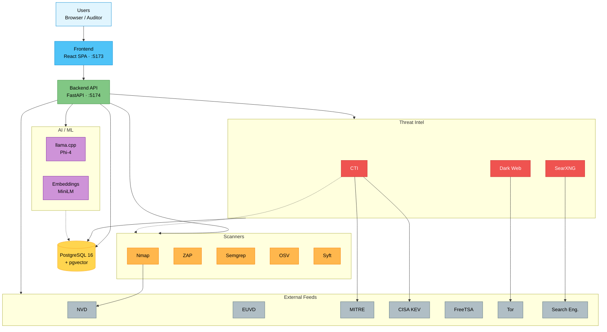
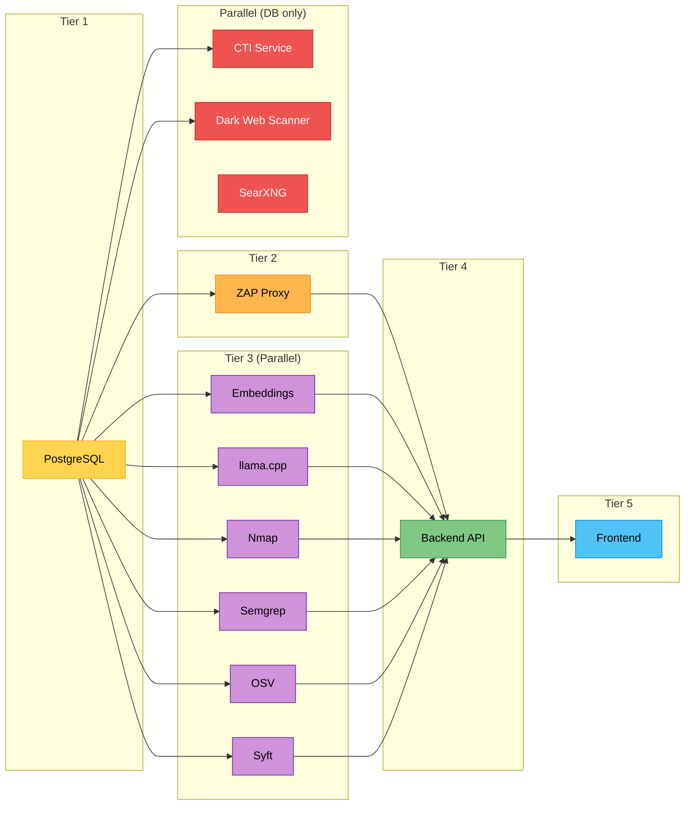
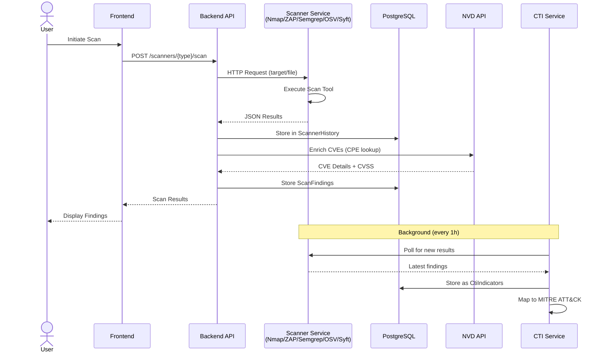
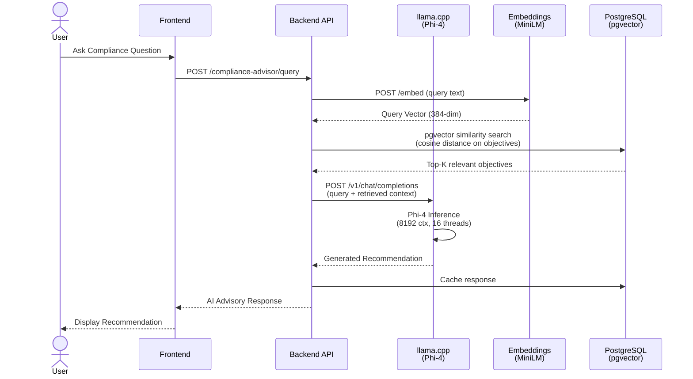
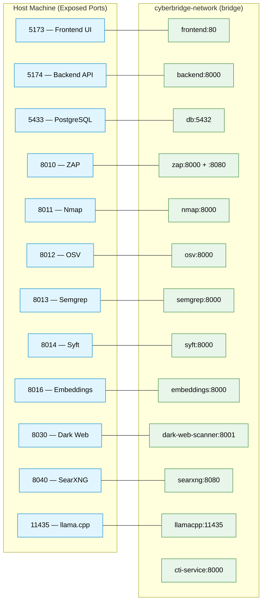
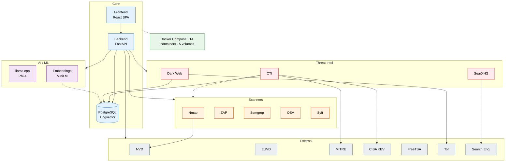
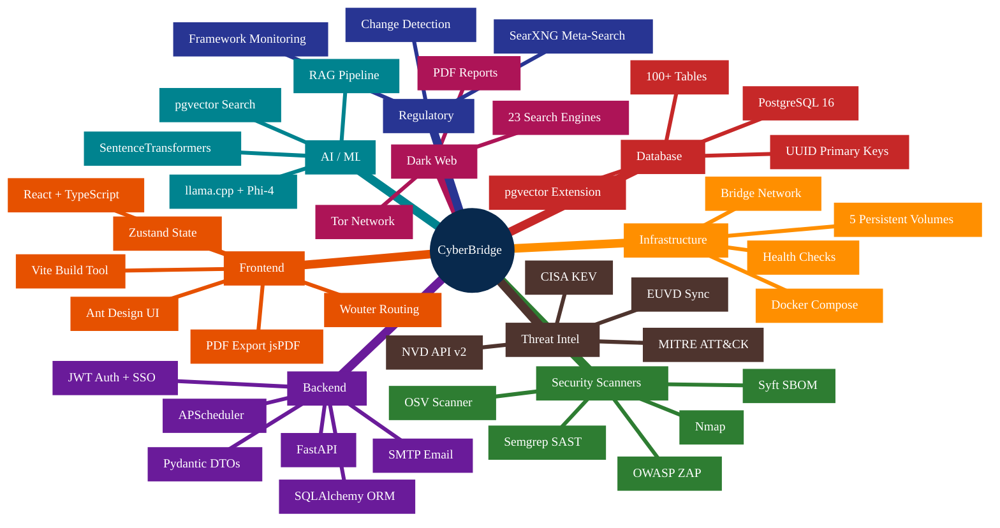

# CyberBridge - End-to-End Architecture Diagram

## High-Level System Architecture

```mermaid
graph TB
    subgraph Users["Users & Clients"]
        Browser["Browser / SPA Client"]
        Auditor["External Auditor<br/>(Magic Link Auth)"]
    end

    subgraph Frontend["Frontend Layer — Port 5173"]
        ReactApp["React + TypeScript + Vite<br/>Ant Design UI<br/>75+ Pages | 56 Zustand Stores<br/>Wouter Routing"]
    end

    subgraph Backend["Backend API Layer — Port 5174 (host) / 8000 (container)"]
        FastAPI["FastAPI Application<br/>59 Route Controllers | 45 Services<br/>46 Repositories | 100+ Models"]

        subgraph BackendModules["Core Modules"]
            AuthModule["Auth & RBAC<br/>JWT / SSO / Magic Links"]
            ComplianceModule["Compliance Engine<br/>Frameworks / Assessments<br/>Gap Analysis / Objectives"]
            RiskModule["Risk Management<br/>Risk Register / Severity<br/>Risk Assessments"]
            ScanOrchestrator["Scan Orchestrator<br/>Scanner Integration<br/>Finding Correlation"]
            AuditModule["Audit & Evidence<br/>Engagements / Findings<br/>Chain of Custody"]
            AIModule["AI Services<br/>LLM Integration<br/>RAG / Embeddings"]
            RegModule["Regulatory Monitor<br/>Framework Updates<br/>Web Search"]
            IncidentModule["Incident Management<br/>ENISA Notifications<br/>Forensic Timeline"]
        end
    end

    subgraph SecurityScanners["Security Scanner Services (Docker Internal Network)"]
        Nmap["Nmap Scanner<br/>Port 8011/8000<br/>Network Recon<br/>Port & Service Detection"]
        ZAP["OWASP ZAP<br/>Port 8010/8000<br/>Web App Security<br/>Spider + Active Scan"]
        Semgrep["Semgrep<br/>Port 8013/8000<br/>SAST Code Analysis<br/>Security Patterns"]
        OSV["OSV Scanner<br/>Port 8012/8000<br/>Dependency Vulns<br/>CVE Matching"]
        Syft["Syft SBOM<br/>Port 8014/8000<br/>CycloneDX SBOM<br/>Component Inventory"]
    end

    subgraph AIServices["AI / ML Services"]
        LlamaCpp["llama.cpp<br/>Port 11435<br/>Phi-4 Model (Q4_K_M)<br/>OpenAI-compatible API"]
        Embeddings["Embeddings Service<br/>Port 8016/8000<br/>all-MiniLM-L6-v2<br/>384-dim Vectors"]
    end

    subgraph ThreatIntel["Threat Intelligence & Monitoring Services"]
        CTI["CTI Service<br/>(Internal Port 8000)<br/>Scanner Aggregation<br/>MITRE ATT&CK Mapping"]
        DarkWeb["Dark Web Scanner<br/>Port 8030/8001<br/>Tor SOCKS Proxy :9050<br/>23 Search Engines"]
        SearXNG["SearXNG<br/>Port 8040/8080<br/>Meta-Search Engine<br/>Regulatory Monitoring"]
    end

    subgraph Database["Data Layer"]
        PostgreSQL[("PostgreSQL 16<br/>+ pgvector Extension<br/>Port 5433 (host) / 5432<br/>UUID Primary Keys")]

        subgraph Volumes["Persistent Volumes"]
            PGData["postgres_data"]
            Uploads["backend_uploads"]
            AuditFiles["audit_attachments"]
            Backups["backend_backups"]
            ZAPData["zap_data"]
        end
    end

    subgraph ExternalAPIs["External APIs & Feeds"]
        NVD["NVD API v2.0<br/>CVE Database"]
        EUVD["EU Vulnerability<br/>Database"]
        MITRE["MITRE ATT&CK<br/>Framework Feed"]
        CISA["CISA KEV<br/>Known Exploited Vulns"]
        FreeTSA["FreeTSA.org<br/>RFC 3161 Timestamps"]
        TorNetwork["Tor Network<br/>Dark Web Access"]
        SearchEngines["Google / Bing /<br/>DuckDuckGo / Scholar"]
    end

    %% User connections
    Browser -->|"HTTPS"| ReactApp
    Auditor -->|"Magic Link"| ReactApp

    %% Frontend to Backend
    ReactApp -->|"REST API + JWT<br/>All /api/* endpoints"| FastAPI

    %% Backend to Scanners
    ScanOrchestrator -->|"HTTP"| Nmap
    ScanOrchestrator -->|"HTTP"| ZAP
    ScanOrchestrator -->|"HTTP"| Semgrep
    ScanOrchestrator -->|"HTTP"| OSV
    ScanOrchestrator -->|"HTTP"| Syft

    %% Backend to AI
    AIModule -->|"OpenAI API<br/>/v1/chat/completions"| LlamaCpp
    AIModule -->|"POST /embed"| Embeddings

    %% Backend to Threat Intel
    FastAPI -->|"HTTP Proxy"| CTI
    FastAPI -->|"HTTP Proxy"| DarkWeb
    RegModule -->|"Search Queries"| SearXNG

    %% Backend to Database
    FastAPI -->|"SQLAlchemy ORM"| PostgreSQL
    CTI -->|"SQLAlchemy"| PostgreSQL
    DarkWeb -->|"Queue Storage"| PostgreSQL

    %% Backend to External APIs
    FastAPI -->|"CVE Lookup"| NVD
    FastAPI -->|"Vuln Sync"| EUVD
    FastAPI -->|"RFC 3161"| FreeTSA

    %% CTI to External Feeds
    CTI -->|"Feed Sync"| MITRE
    CTI -->|"Feed Sync"| CISA

    %% CTI polls scanners
    CTI -.->|"Poll Results<br/>(APScheduler 1h)"| Nmap
    CTI -.->|"Poll Results"| ZAP
    CTI -.->|"Poll Results"| Semgrep
    CTI -.->|"Poll Results"| OSV

    %% Dark Web to Tor
    DarkWeb -->|"SOCKS5 :9050"| TorNetwork

    %% SearXNG to Search Engines
    SearXNG -->|"Meta-Search"| SearchEngines

    %% Embeddings to Database (pgvector)
    Embeddings -.->|"Vector Storage"| PostgreSQL

    %% Volume connections
    PostgreSQL --- PGData
    FastAPI --- Uploads
    FastAPI --- AuditFiles
    FastAPI --- Backups
    ZAP --- ZAPData

    %% Nmap enrichment
    Nmap -->|"CPE → CVE"| NVD

    %% Styling
    classDef frontend fill:#4FC3F7,stroke:#0288D1,color:#000
    classDef backend fill:#81C784,stroke:#388E3C,color:#000
    classDef scanner fill:#FFB74D,stroke:#F57C00,color:#000
    classDef ai fill:#CE93D8,stroke:#7B1FA2,color:#000
    classDef threat fill:#EF5350,stroke:#C62828,color:#fff
    classDef db fill:#FFD54F,stroke:#F9A825,color:#000
    classDef external fill:#B0BEC5,stroke:#546E7A,color:#000
    classDef user fill:#E1F5FE,stroke:#0288D1,color:#000

    class Browser,Auditor user
    class ReactApp frontend
    class FastAPI,AuthModule,ComplianceModule,RiskModule,ScanOrchestrator,AuditModule,AIModule,RegModule,IncidentModule backend
    class Nmap,ZAP,Semgrep,OSV,Syft scanner
    class LlamaCpp,Embeddings ai
    class CTI,DarkWeb,SearXNG threat
    class PostgreSQL,PGData,Uploads,AuditFiles,Backups,ZAPData db
    class NVD,EUVD,MITRE,CISA,FreeTSA,TorNetwork,SearchEngines external
```

### Description

This diagram provides a complete end-to-end view of the CyberBridge platform, showing every major subsystem and how they communicate. **Users** (standard browser users and external auditors authenticated via magic links) interact with the **React + TypeScript SPA** on port 5173, which issues authenticated REST calls to the **FastAPI backend** (host port 5174 → container port 8000). The backend is organised into eight core modules — Auth/RBAC, Compliance Engine, Risk Management, Scan Orchestrator, Audit & Evidence, AI Services, Regulatory Monitor, and Incident Management — that collectively expose 59 route controllers over 45 services and 46 repositories.

The backend delegates specialised work to three families of microservices on the internal Docker network: **security scanners** (Nmap, OWASP ZAP, Semgrep, OSV, Syft) for vulnerability and SBOM analysis; **AI/ML services** (llama.cpp running Phi-4 and an Embeddings service running all-MiniLM-L6-v2) for RAG-powered advisory; and **threat-intelligence services** (CTI aggregator, Tor-based Dark Web Scanner, SearXNG meta-search) for regulatory and threat monitoring. All persistent data lives in a single **PostgreSQL 16 + pgvector** instance (host 5433 → 5432) with five named volumes (`postgres_data`, `backend_uploads`, `audit_attachments`, `backend_backups`, `zap_data`). Outbound integrations include the NVD and EU Vulnerability databases, MITRE ATT&CK, CISA KEV, FreeTSA RFC 3161 timestamping, the Tor network, and public search engines. Dashed lines denote scheduled background polling (CTI pulls scanner results hourly via APScheduler; embeddings are written asynchronously to pgvector).

### Compact Version

#### Description

A condensed top-to-bottom redraw of the high-level architecture that keeps every logical tier but collapses the per-node detail (port numbers, model versions, module breakdowns) to fit a narrower viewport. Users enter through the **Frontend**, which calls the **Backend API**; the backend fans out to three horizontal subgraphs — **Scanners**, **AI/ML**, and **Threat Intel** — and persists everything to a single **PostgreSQL + pgvector** instance. Outbound **External Feeds** are grouped at the bottom. Dashed arrows still represent the asynchronous flows (CTI polling, vector writes). Use this version when embedding the diagram in slides or narrow documentation panes; use the full version above when you need exact ports, module names, or volume details.

## Service Dependency & Startup Order

### Description

This diagram shows the tiered boot sequence enforced by Docker Compose health checks so that dependent services only start once their prerequisites are healthy. **Tier 1** brings up **PostgreSQL** first, since every other stateful service needs it. **Tier 2** starts **OWASP ZAP**, which is promoted to its own tier because it has the longest initialisation time (spider/active-scan engines plus its internal API warmup) and the backend depends on it being reachable. **Tier 3** starts six services in parallel — **Embeddings**, **llama.cpp**, **Nmap**, **Semgrep**, **OSV**, and **Syft** — because they are mutually independent and only require the database. **Tier 4** starts the **Backend API** once every scanner and AI service is reachable, guaranteeing the FastAPI app never proxies to an un-ready dependency. **Tier 5** starts the **Frontend**, which only needs the API to be healthy.

The **Parallel** group (**CTI Service**, **Dark Web Scanner**, **SearXNG**) is shown separately because these services only depend on the database and run independently of the main request path — they can come up alongside Tier 3 without blocking backend readiness. This layered ordering is what allows `docker-compose up -d` to come up deterministically even on slower hosts.

## Data Flow: Security Scan Pipeline

### Description

This sequence diagram traces the full lifecycle of a security scan from the moment a user clicks "Scan" in the UI. The **Frontend** posts to the backend's `/scanners/{type}/scan` endpoint, which dispatches an HTTP request to the appropriate **Scanner Service** (Nmap, ZAP, Semgrep, OSV, or Syft) with either the target URL/host or the uploaded file. The scanner executes its underlying tool and returns normalized JSON, which the backend persists to `ScannerHistory`. For network and dependency scans the backend then enriches each finding by querying the **NVD API** for CVE details and CVSS scores, and writes the enriched results to `ScanFindings` before returning them to the user.

The bottom of the diagram shows the asynchronous ingestion path: the **CTI Service** runs an APScheduler job every hour that polls each scanner for new results, stores them as normalized `CtiIndicators`, and maps them to MITRE ATT&CK techniques. This decoupling is important — scan results are immediately usable by the frontend (synchronous path), while the CTI service independently builds the long-term threat-intelligence view (asynchronous path) without blocking user-facing latency.

## Data Flow: AI-Powered Compliance Advisory

### Description

This sequence diagram documents the **Retrieval-Augmented Generation (RAG)** pipeline used by the AI Compliance Advisor. When a user submits a compliance question, the frontend posts it to `/compliance-advisor/query`. The backend first sends the raw question to the **Embeddings Service** (all-MiniLM-L6-v2), which returns a 384-dimensional query vector. The backend then runs a **pgvector cosine-similarity search** against pre-embedded framework objectives in PostgreSQL, returning the top-K most relevant objectives as context.

The retrieved context is packaged with the original question into a prompt and sent to **llama.cpp** via an OpenAI-compatible `/v1/chat/completions` call. The Phi-4 model (Q4_K_M quantization, 8192-token context, 16 threads) generates a grounded recommendation that cites the retrieved objectives. The response is cached in the database and returned to the user. This architecture means every AI answer is anchored in actual framework text from the organisation's assessments, which reduces hallucinations and makes recommendations auditable — a critical property for compliance work.

## Network & Port Map

### Description

This diagram maps every **host-machine port** (left column) to its corresponding **container port** on the internal `cyberbridge-network` bridge network (right column). The host ports are what a developer or operator connects to from outside the Docker stack; the container ports are what the services bind to internally. Most microservices listen on container port `8000` and are exposed on a unique host port (`8010`–`8016`, `8030`, `8040`) to avoid collisions when accessed from the host.

Notable mappings: the **Frontend** is exposed on `5173`, the **Backend** on `5174`, **PostgreSQL** on `5433` (mapped from the standard `5432` to avoid clashing with a local Postgres install), **OWASP ZAP** on `8010`, **Nmap** on `8011`, **OSV** on `8012`, **Semgrep** on `8013`, **Syft** on `8014`, **Embeddings** on `8016`, **Dark Web Scanner** on `8030` (container `8001`), **SearXNG** on `8040` (container `8080`), and **llama.cpp** on `11435`. The **CTI Service** (`cti-service:8000`) is intentionally *not* exposed to the host — it is only reachable from other containers, which enforces that external clients always go through the backend API proxy rather than hitting CTI directly.

## Component Catalog

```mermaid
graph TB
    subgraph core["CORE PLATFORM"]
        FE["<b>FRONTEND — React SPA</b><br/>React + TypeScript + Vite + Ant Design<br/>75+ pages, 56 Zustand stores, Wouter routing<br/>Compliance dashboards, scanning UI, AI advisory<br/><i>Port: 5173</i>"]

        BE["<b>BACKEND API — FastAPI</b><br/>59 route controllers, 45 services, 46 repositories<br/>Orchestrates scanners, auth (JWT/SSO/magic links),<br/>compliance workflows, risk, audit, incident mgmt<br/><i>Port: 5174 → 8000</i>"]

        DB[("<b>DATABASE — PostgreSQL 16 + pgvector</b><br/>100+ tables, UUID primary keys<br/>Users, frameworks, assessments, risks, policies,<br/>scan results, evidence, audit trails<br/>pgvector for RAG semantic search<br/><i>Port: 5433 → 5432</i>")]
    end

    subgraph scanners["SECURITY SCANNERS"]
        NM["<b>NMAP — Network Scanner</b><br/>Port/service detection, OS fingerprinting<br/>CPE-to-CVE enrichment via NVD API<br/><i>Port: 8011 → 8000</i>"]

        ZP["<b>OWASP ZAP — Web App Scanner</b><br/>Spider crawling + active scanning<br/>OWASP Top 10 vulnerability detection<br/><i>Port: 8010 → 8000</i>"]

        SG["<b>SEMGREP — Code Scanner (SAST)</b><br/>Static analysis on uploaded source code<br/>Security patterns, code quality rules<br/><i>Port: 8013 → 8000</i>"]

        OV["<b>OSV SCANNER — Dependency Scanner</b><br/>Scans lock files for known CVEs<br/>NPM, PyPI, Go module support<br/><i>Port: 8012 → 8000</i>"]

        SY["<b>SYFT — SBOM Generator</b><br/>CycloneDX Bill of Materials<br/>Components, versions, licenses inventory<br/><i>Port: 8014 → 8000</i>"]
    end

    subgraph ai["AI / ML SERVICES"]
        LL["<b>LLAMA.CPP — LLM Engine</b><br/>Phi-4 quantized model (Q4_K_M)<br/>OpenAI-compatible API, 8192 ctx window<br/>Risk recommendations, gap analysis, advisory<br/><i>Port: 11435</i>"]

        EM["<b>EMBEDDINGS — SentenceTransformers</b><br/>all-MiniLM-L6-v2 (384-dim vectors)<br/>RAG pipeline: embeds objectives and queries<br/>pgvector semantic similarity search<br/><i>Port: 8016 → 8000</i>"]
    end

    subgraph threat["THREAT INTELLIGENCE & MONITORING"]
        CT["<b>CTI SERVICE — Threat Aggregation</b><br/>Polls all scanners on 1-hour schedule<br/>Syncs MITRE ATT&CK + CISA KEV feeds<br/>Unified threat intelligence dashboards<br/><i>Internal port: 8000</i>"]

        DW["<b>DARK WEB SCANNER — Tor Search</b><br/>SOCKS5 proxy across 23 dark web engines<br/>Detects leaked credentials and data<br/>Queue-based, generates PDF reports<br/><i>Port: 8030 → 8001</i>"]

        SX["<b>SEARXNG — Regulatory Monitor</b><br/>Meta-search: Google, Bing, Scholar, DDG<br/>Detects regulatory changes in CRA, NIS2,<br/>ISO 27001, GDPR, NIST, DORA<br/><i>Port: 8040 → 8080</i>"]
    end

    subgraph external["EXTERNAL FEEDS & APIs"]
        NVD["<b>NVD API v2.0</b><br/>CVE/CVSS vulnerability lookup"]
        EUVD["<b>EU Vulnerability DB</b><br/>EU-specific advisories"]
        MITRE["<b>MITRE ATT&CK</b><br/>Technique/tactic mapping"]
        CISA["<b>CISA KEV</b><br/>Known exploited vulns"]
        TSA["<b>FreeTSA.org</b><br/>RFC 3161 timestamps"]
        TOR["<b>Tor Network</b><br/>Dark web access"]
        SEARCH["<b>Search Engines</b><br/>Google, Bing, DDG, Scholar"]
    end

    subgraph infra["INFRASTRUCTURE"]
        VOL["<b>DOCKER COMPOSE STACK</b><br/>14 containers · cyberbridge-network (bridge)<br/>5 persistent volumes: postgres_data,<br/>backend_uploads, audit_attachments,<br/>backend_backups, zap_data<br/>Tiered startup with health checks"]
    end

    FE -->|"REST API + JWT"| BE
    BE -->|"SQLAlchemy ORM"| DB
    BE -->|"HTTP"| NM
    BE -->|"HTTP"| ZP
    BE -->|"HTTP"| SG
    BE -->|"HTTP"| OV
    BE -->|"HTTP"| SY
    BE -->|"OpenAI API"| LL
    BE -->|"POST /embed"| EM
    BE -->|"HTTP proxy"| CT
    BE -->|"HTTP proxy"| DW
    BE -->|"Search queries"| SX
    BE -->|"CVE lookup"| NVD
    BE -->|"Vuln sync"| EUVD
    BE -->|"RFC 3161"| TSA
    CT -->|"Feed sync"| MITRE
    CT -->|"Feed sync"| CISA
    CT -.->|"Poll results"| NM
    CT -.->|"Poll results"| ZP
    CT -.->|"Poll results"| SG
    CT -.->|"Poll results"| OV
    CT -->|"SQLAlchemy"| DB
    DW -->|"SQLAlchemy"| DB
    DW -->|"SOCKS5"| TOR
    SX -->|"Meta-search"| SEARCH
    EM -.->|"Vector storage"| DB
    NM -->|"CPE enrichment"| NVD

    classDef coreStyle fill:#E3F2FD,stroke:#1565C0,color:#000
    classDef scanStyle fill:#FFF3E0,stroke:#E65100,color:#000
    classDef aiStyle fill:#F3E5F5,stroke:#6A1B9A,color:#000
    classDef threatStyle fill:#FFEBEE,stroke:#C62828,color:#000
    classDef extStyle fill:#ECEFF1,stroke:#546E7A,color:#000
    classDef infraStyle fill:#E8F5E9,stroke:#2E7D32,color:#000

    class FE,BE,DB coreStyle
    class NM,ZP,SG,OV,SY scanStyle
    class LL,EM aiStyle
    class CT,DW,SX threatStyle
    class NVD,EUVD,MITRE,CISA,TSA,TOR,SEARCH extStyle
    class VOL infraStyle
```

### Description

This catalog groups every component in the platform by functional role, with each box summarizing the component's responsibility, technology, and port binding. The **Core Platform** tier contains the three components that every user request flows through: the **Frontend** React SPA, the **Backend** FastAPI application, and the **PostgreSQL + pgvector** database. The **Security Scanners** tier contains the five scanning microservices, each specialised for a different attack surface — Nmap for network reconnaissance, ZAP for dynamic web-app testing, Semgrep for static code analysis, OSV for dependency vulnerabilities, and Syft for SBOM generation.

The **AI/ML Services** tier captures the two AI components: **llama.cpp** (Phi-4 inference) and the **Embeddings** service (SentenceTransformers). The **Threat Intelligence & Monitoring** tier groups the three services that operate on longer time horizons — the **CTI Service** (aggregates scanner output and external feeds), the **Dark Web Scanner** (Tor-based leaked-credential search), and **SearXNG** (regulatory change detection). The **External Feeds & APIs** tier lists the seven third-party data sources the platform integrates with. The **Infrastructure** tier summarizes the Docker Compose orchestration: 14 containers, one bridge network, five persistent volumes, and health-checked tiered startup. The arrows show the request/data direction between components, with dashed lines indicating asynchronous or scheduled flows (CTI polling, vector storage).

### Compact Version

#### Description

A condensed variant of the component catalog that preserves the six functional tiers (**Core**, **Scanners**, **AI/ML**, **Threat Intel**, **External**, **Infrastructure**) but strips each node down to its name and one identifying detail so the layout fits a narrow column. The arrow topology is unchanged — the backend still fans out to scanners, AI, threat-intel, and external feeds, with dashed lines for asynchronous flows (CTI polling scanners, embeddings writing vectors to pgvector) — but all per-component metadata (port mappings, framework coverage, engine counts, model sizes) has been delegated to the full version above. Use this for overview slides or READMEs; use the full catalog when operators need to reason about exact ports or capabilities.

## Technology Stack Summary

### Description

This mindmap provides a bird's-eye inventory of the entire technology stack, organised by architectural layer. The **Frontend** layer lists the React/TypeScript toolchain (Vite, Ant Design, Zustand, Wouter, jsPDF). The **Backend** layer lists the FastAPI stack and its cross-cutting capabilities — SQLAlchemy ORM, Pydantic DTOs, APScheduler for background jobs, JWT and SSO authentication, and SMTP email delivery. The **Database** layer calls out PostgreSQL 16, the pgvector extension for RAG, UUID primary keys, and the 100+ table schema footprint.

The remaining branches enumerate the specialised subsystems: five **Security Scanners** (ZAP, Nmap, Semgrep, OSV, Syft), the **AI/ML** pipeline (llama.cpp + Phi-4, SentenceTransformers, RAG, pgvector search), the **Threat Intelligence** feeds (MITRE ATT&CK, CISA KEV, NVD v2, EUVD), the **Dark Web** stack (Tor, 23 search engines, PDF reports), the **Regulatory** monitoring stack (SearXNG, framework monitoring, change detection), and the **Infrastructure** foundation (Docker Compose, bridge networking, 5 persistent volumes, health checks). Unlike the other diagrams, this one is intentionally non-relational — it answers "what technologies are involved?" rather than "how do they connect?" and is intended as a quick onboarding reference for new engineers.
