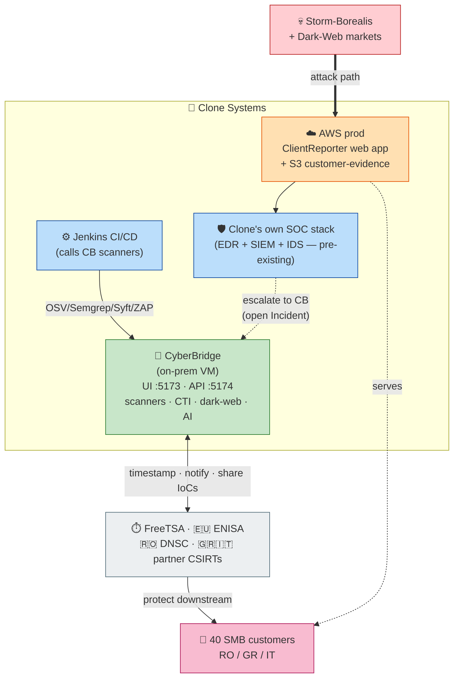
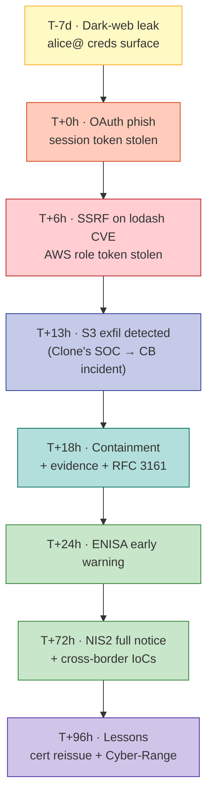
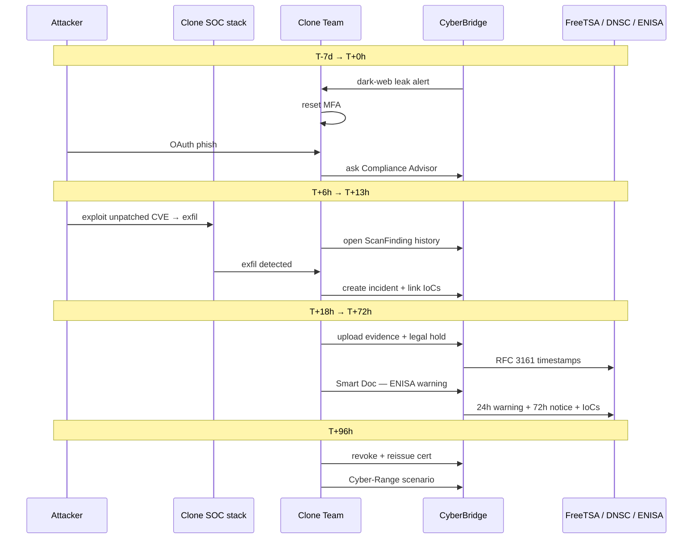

# Pilot Use Case — Clone Systems Under Attack

> **Aligns with**: PUC #2 — *Enabling SMEs with Advanced Cybersecurity Solutions and Cross-Border Compliance — Clone Systems* (`EU Projects/CYBERBRIDGE/PUC.png`).
> **Pilot organisation**: **Clone Systems** — [https://www.clone-systems.com/](https://www.clone-systems.com/) — a medium-sized cybersecurity firm (SOC-as-a-Service, SIEM with EDR, Managed IPS, vulnerability assessments, automated pentesting).
> **Goal**: walk a realistic intrusion against Clone Systems and show how CyberBridge supports detection, investigation, NIS2 reporting, and cross-border collaboration.

---

## Contents

1. [Scenario at a Glance](#1-scenario-at-a-glance)
2. [Cast](#2-cast)
3. [Reference Infrastructure](#3-reference-infrastructure)
4. [Attack Timeline](#4-attack-timeline)
5. [Phase-by-Phase Walkthrough](#5-phase-by-phase-walkthrough)
6. [Response Workflow](#6-response-workflow)
7. [Outcomes — KPIs & KERs](#7-outcomes--kpis--kers)
8. [Pilot Setup Notes](#8-pilot-setup-notes)

---

## 1. Scenario at a Glance

A financially-motivated APT group, **Storm-Borealis**, targets Clone Systems because compromising one MSSP yields downstream access to ~40 customer SMBs in Romania, Greece and Italy — a textbook NIS2 supply-chain risk.

The attack chain: **leaked credentials → OAuth-consent phishing → SSRF in an unpatched web app → AWS instance-role theft → S3 exfiltration of customer evidence**.

CyberBridge is installed on a Clone-Systems on-prem VM and is wired to Clone's Jenkins pipeline (so its OSV / Semgrep / Syft / ZAP scanners run on every build). It **proactively** surfaces the dark-web credential leak, the unremediated lodash CVE, the failing compliance objectives. It does **not** replace Clone's runtime EDR/IDS — Clone is itself an MSSP and runs its own. Once Clone's own SOC tooling detects the exfil, the analyst opens the incident in CyberBridge to drive the **compliance side** of the response: evidence collection with chain-of-custody and RFC 3161 timestamps, the NIS2 24-h / 72-h notifications, cross-border IoC sharing, certificate revoke/reissue, and a new Cyber-Range training scenario.

> **Scope note on CyberBridge:** the CyberBridge stack ships scanners (Nmap, OWASP ZAP, Semgrep, OSV, Syft), AI services (llama.cpp + embeddings), CTI aggregation, dark-web scanning, regulatory-change monitoring, and the compliance/evidence/incident/audit modules. It does **not** ship an EDR, SIEM, IDS or email-security gateway — those are assumed to exist in the customer environment and can optionally feed CyberBridge through the CTI integration endpoints.

---

## 2. Cast

| Persona | Role |
|---------|------|
| **Helena** | CISO — signs incident notifications |
| **Alice** | SOC analyst — first responder |
| **Bjorn** | DevSecOps — owns Jenkins + scanners |
| **Iris** | IT/identity admin |
| **Marco** | External pentester (magic-link auditor) |
| **DNSC + ENISA + partner CSIRTs** | Receive cross-border notifications |

---

## 3. Reference Infrastructure

CyberBridge runs on a dedicated on-prem VM at Clone (`docker-compose up -d`) and integrates with Clone's existing Jenkins pipeline. The web app under attack lives in Clone's AWS production VPC. Clone's runtime telemetry (their own MSSP toolchain) is shown separately — it is **not** part of the CyberBridge stack.

| Zone | What lives there | Bundled with CyberBridge? |
|------|------------------|---------------------------|
| **Storm-Borealis** | Adversary VPS + dark-web credential markets. | — |
| **CyberBridge** | Compliance/risk/incident modules + scanners (Nmap, ZAP, Semgrep, OSV, Syft) + CTI + dark-web + AI + RAG. | ✅ |
| **Jenkins CI/CD** | Clone's build server, calls CyberBridge scanner endpoints. | Pre-existing at Clone; integrated. |
| **Clone's own SOC stack** | Clone's runtime EDR / SIEM / IDS (Clone is an MSSP). Provides exfil detection. | ❌ — Clone's own; CyberBridge can optionally ingest its alerts via CTI. |
| **AWS prod** | ClientReporter web app + customer-evidence S3 bucket. | Clone-owned. |
| **External** | FreeTSA, ENISA, DNSC, partner CSIRTs. | Outbound integrations. |
| **Customers** | 40 SMBs (5 RO, 18 GR, 17 IT) — recipients of cross-border IoCs. | — |

---

## 4. Attack Timeline

---

## 5. Phase-by-Phase Walkthrough

### Phase 0 — Pre-incident posture (T-30d)
Helena seeds the **Clone Systems** tenant with CRA / NIS2 / ISO 27001 / GDPR frameworks and runs a baseline assessment (87 % compliant). Bjorn wires **OSV / Semgrep / Syft / ZAP** into Jenkins. The latest OSV run flags **`lodash <4.17.21` (CVE-2021-23337)** in `clientreporter` — left as `is_remediated = False` for "next sprint". **This becomes the foothold.** Iris configures **dark-web monitoring** for `clone-systems.com`.

### Phase 1 — Recon (T-7d)
The scheduled dark-web scan returns a hit: **`alice@clone-systems.com`** in a 2023 third-party leak. Iris forces password reset + MFA — but Storm-Borealis pivots to phishing.

### Phase 2 — Initial access (T+0h)
Alice approves a malicious **OAuth-consent app** posing as ServiceNow. Clone's own M365 telemetry flags the suspicious app — CyberBridge has no native email-security feature here. Alice opens the **AI Compliance Advisor** to ask "what NIS2 obligations apply if a SOC analyst's account is compromised?" — the RAG answer cites Art. 23 timelines, which sets the reporting clock that the rest of the pilot revolves around.

### Phase 3 — Exploitation (T+6h)
Storm-Borealis uses Alice's session to discover `clientreporter.clone-systems.com`, exploits the **unremediated lodash SSRF**, hits `169.254.169.254` and steals an EC2 instance-role token. Bjorn opens **Scanner History** and sees the same finding has been ignored for 12 days. He generates an **AI Roadmap** for ISO 27001 A.8.8.

### Phase 4 — Detection (T+13h)
**Clone's own SOC tooling** (their EDR/SIEM, not part of CyberBridge) flags 2 GB of S3 egress to a Mauritius IP. Alice escalates **into CyberBridge** by creating **`INC-2026-014`** (`POST /incidents`) and links 4 ScanFindings + 2 Risks + 6 Assets — turning a SOC ticket into a tracked compliance incident. **The NIS2 24-h clock starts here.**

### Phase 5 — Containment + forensics (T+14–24h)
Iris rotates IAM and locks the bucket. Each artefact (CloudTrail, PCAP, phishing email, payload) is uploaded via `POST /evidence/upload`, hash-chained in `CustodyTransfer`, and **RFC 3161-timestamped** via FreeTSA. The bucket and evidence go on **legal hold** (`POST /legal-holds/evidence/{id}`).

### Phase 6 — Cross-border reporting (T+24–72h)
The **Smart Documentation Generator** drafts the ENISA early warning at T+24h and the full NIS2 notification at T+72h. Pre-seeded `SubmissionEmailConfig` routes both to **DNSC, ENISA, HellenicCERT, CSIRT-Italia**. IoCs (phishing domain, attacker IPs, OAuth app ID, SSRF payload) are exported via `/cti/indicators`. Two Greek SMBs detect the same phishing domain within 4 hours and avoid compromise.

### Phase 7 — Lessons (T+96h)
The 87 % NIS2 certificate is **revoked + reissued** after remediation. Bjorn adds a **CI/CD gating policy**: builds with unremediated High/Critical findings cannot promote. The full attack chain becomes a **Cyber-Range scenario** delivered to 15 SOC analysts. Marco reviews the engagement via **magic link** and signs off (RFC 3161-timestamped).

---

## 6. Response Workflow

---

## 7. Outcomes — KPIs & KERs

| KPI | Evidence from this pilot |
|-----|--------------------------|
| **KPI_02** Compliance reports | 3 (early warning + full notice + audit pack) |
| **KPI_03** SOC adoption | Clone SOC uses CTI dashboard daily |
| **KPI_06** IT-based incident solutions | Scanner + CTI + dark-web + RFC 3161 chain |
| **KPI_09** Stakeholders trained | 15 analysts via Cyber-Range scenario |
| **KPI_17** Cross-border investigations | 1 (Storm-Borealis, RO + GR + IT) |
| **KPI_18** Evidence-collection time | ~6h/artefact → ~15 min/artefact |

| KER | Demonstrated by |
|-----|-----------------|
| KER.1 AI compliance management | Compliance Advisor + AI Roadmap |
| KER.3 Forensics tools | Evidence + custody chain + RFC 3161 |
| KER.4 Threat-intel sharing | Cross-border IoC export |
| KER.5 Collaborative IR for SOCs | Incident module + cross-org alerting |
| KER.6 Certification framework | Revoke + reissue certificate |
| KER.8 Training program | New Cyber-Range exercise |

---

## 8. Pilot Setup Notes

- **Stack**: `docker-compose up -d` on a Clone Systems VM. UI `:5173`, API `:5174`. Scanners `:8010-8016`, Dark-Web `:8030`, SearXNG `:8040`, llama.cpp `:11435`. The internal `cti-service` is **not** exposed.
- **Tenant prep**: seed `Clone Systems` Organisation + 4 frameworks; create the 5 personas; invite Marco via magic link.
- **Synthetic data only**: phishing email, OAuth app ID, attacker IPs, lodash CVE, S3 logs are synthetic. **Never** point `SubmissionEmailConfig` at real authority addresses during the pilot — use test mailboxes.
- **Pre-incident state**: include at least one unremediated **High** `ScanFinding` so Phase 3 lands.
- **Egress required**: `freetsa.org` for RFC 3161, NVD/EUVD for vuln sync, Tor for dark-web.

**Cross-references**: source PUC `EU Projects/CYBERBRIDGE/PUC.png` · architecture `docs/architecture-diagram.md` · requirements `docs/requirements.md` · ISO 27001 readiness pilot `docs/clone_systems_pilot_use_case.md`.
